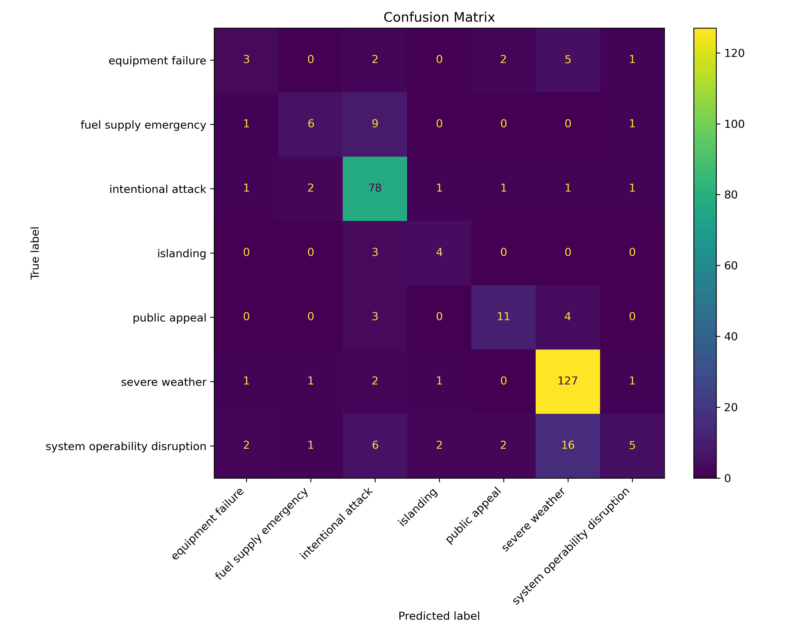

# Analysis of Power Outages
This is a project completed for DSC 80 at UCSD.

By Fred Danese

# Introduction
This project explores a dataset of major power outages across the U.S. from January 2000 to July 2016. These outages, as defined by the Department of Energy, impacted at least 50,000 customers or caused an unplanned energy demand loss of 300 Megawatts or more. The dataset was sourced from Purdue University’s Laboratory for Advancing Sustainable Critical Infrastructure and provides a wealth of information, including outage details, geographical data, climate characteristics, electricity usage, and economic factors.

The central question of this project is: Where and when do major power outages tend to occur? This question is crucial as understanding the spatial and temporal patterns of outages can help utility companies and policymakers prepare for and potentially mitigate future outages. Predicting when and where outages are likely to occur can lead to improved infrastructure, better resource allocation, and more effective disaster response strategies.

The dataset contains 1,534 rows and 56 columns, but the following columns are particularly relevant to my question:

| **Column Name**           | **Description**                                                                                   |
|----------------------------|---------------------------------------------------------------------------------------------------|
| **`YEAR`**                | The year when the outage occurred.                                                               |
| **`MONTH`**               | The month when the outage occurred.                                                              |
| **`U.S._STATE`**          | The state where the outage occurred.                                                             |
| **`NERC.REGION`**         | The North American Electric Reliability Corporation region responsible for the affected area.     |
| **`CLIMATE.REGION`**      | The U.S. Climate region associated with the affected area.                                        |
| **`CAUSE.CATEGORY`**      | Broad categories describing the cause of the outage (e.g., severe weather or equipment failure).  |
| **`CAUSE.CATEGORY.DETAIL`** | Specific details about the cause of the outage within the broader `CAUSE.CATEGORY`.              |
| **`OUTAGE.DURATION.HOURS`**| The duration of the outage in hours.                                                             |
| **`CUSTOMERS.AFFECTED`**   | The number of customers affected by the outage.                                                  |
| **`DEMAND.LOSS.MW`**       | The energy demand loss caused by the outage in megawatts.                                        |
| **`OUTAGE.START`**         | The combined start date and time of the outage.                                                  |
| **`OUTAGE.RESTORATION`**   | The combined restoration date and time of the outage.                                            |

# Data Cleaning and Exploratory Data Analysis

First things first, the dataset needs to be cleaned to make it useable for our analysis.

## Cleaning

1. First, I combined the `OUTAGE.START.DATE` and `OUTAGE.START.TIME` columns into a single Timestamp object in the column `OUTAGE.START`. I performed the same combination for `OUTAGE.RESTORATION.DATE` and `OUTAGE.RESTORATION.TIME` into the column `OUTAGE.RESTORATION`. I then dropped the columns used for their combination.

2. Next, I added a column `OUTAGE.DURATION.HOURS` which converted outage duration times from minutes to hours to improve readability and make interpreting results easier.

3. Some columns such as `OUTAGE.DURATION`, `OUTAGE.DURATION.HOURS`, `CUSTOMERS.AFFECTED`, and `DEMAND.LOSS.MW` contained values of 0, which are likely to be missing values (since major outages wouldn't last 0 minutes). The value np.nan was used in place of all 0s in these columns.

Here are the first few rows of the cleaned DataFrame.

| YEAR | MONTH | U.S._STATE | NERC.REGION | CLIMATE.REGION    | CAUSE.CATEGORY   | CAUSE.CATEGORY.DETAIL | OUTAGE.DURATION.HOURS | CUSTOMERS.AFFECTED | DEMAND.LOSS.MW | OUTAGE.START       | OUTAGE.RESTORATION |
|------|-------|------------|-------------|-------------------|------------------|-----------------------|-----------------------|--------------------|-----------------|--------------------|---------------------|
| 2011 | 7.0   | Minnesota  | MRO         | East North Central | severe weather   | NaN                   | 51.000000            | 70000.0           | NaN             | 2011-07-01 17:00:00 | 2011-07-03 20:00:00 |
| 2014 | 5.0   | Minnesota  | MRO         | East North Central | intentional attack | vandalism             | 0.016667             | NaN               | NaN             | 2014-05-11 18:38:00 | 2014-05-11 18:39:00 |
| 2010 | 10.0  | Minnesota  | MRO         | East North Central | severe weather   | heavy wind            | 50.000000            | 70000.0           | NaN             | 2010-10-26 20:00:00 | 2010-10-28 22:00:00 |
| 2012 | 6.0   | Minnesota  | MRO         | East North Central | severe weather   | thunderstorm          | 42.500000            | 68200.0           | NaN             | 2012-06-19 04:30:00 | 2012-06-20 23:00:00 |
| 2015 | 7.0   | Minnesota  | MRO         | East North Central | severe weather   | NaN                   | 29.000000            | 250000.0          | 250.0           | 2015-07-18 02:00:00 | 2015-07-19 07:00:00 |

## Exploratory Data Analysis

### Univariate Analysis

I first performed some univariate analysis of the distribution of single variables to get an idea of certain patterns in the dataset.

First I checked to see what the main causes of major power outages were.

<iframe
  src="assets/Major_Outage_Causes.html"
  width="800"
  height="600"
  frameborder="0"
></iframe>

Then I wanted to see which climate regions experienced the most outages.

<iframe
  src="assets/Region_Outage_Count.html"
  width="800"
  height="600"
  frameborder="0"
></iframe>

I also wanted to know what the distribution of outage dirations looked like.

<iframe
  src="assets/Outage_Duration(Hours).html"
  width="800"
  height="600"
  frameborder="0"
></iframe>

### Bivariate Analysis

I also conducted some bivariate analysis to observe the realationships between certain variables. 

The relationship between which states have longer power outages can be insightful, so I calculated the average outage duration for each state. Here is its distribution. States like Wisconsin, Michigan, and New York are states that are geographically close together and are also at the higher end of average outage duration.

<iframe
  src="assets/AvgOutDurationByState.html"
  width="1000"
  height="600"
  frameborder="0"
></iframe>

I wanted to compare these results to the average outage duration for each climate region and see if there were some clear indicators or patterns. The east north central region had the highest average duration, falling in line with the pattern observed earlier.

<iframe
  src="assets/RegionOutageDuration.html"
  width="800"
  height="600"
  frameborder="0"
></iframe>

Then I wanted to observe how the number of outages per year has changed over time to see if there are any actionable insights. There is a noteable spike in outages in 2011, which may indicate some sort of special occurence.

<iframe
  src="assets/OutagesPerYear.html"
  width="800"
  height="600"
  frameborder="0"
></iframe>

### Grouping and Aggregates

To gain deeper insights into the characteristics of power outages, I performed grouping and aggregation on two important aspects of the data: NERC Regions and Climate Regions.

First, I grouped the data by NERC Region and calculated the mean values for Outage Duration (Hours), Customers Affected, and Demand Loss (MW). This aggregation helps to identify the average impact of power outages in each NERC Region. The first few rows of the resulting DataFrame are shown below.

| NERC.REGION  | OUTAGE.DURATION.HOURS | CUSTOMERS.AFFECTED | DEMAND.LOSS.MW |
|--------------|------------------------|--------------------|----------------|
| ASCC         | NaN                   | 14273              | 35.0           |
| ECAR         | 93.388542             | 256354.187500      | 1314.483871    |
| FRCC         | 71.185271             | 289778.181818      | 804.450000     |
| FRCC, SERC   | 14.922222             | 126728.666667      | 466.666667     |
| HECO         | 22.783333             | 294000.000000      | 1060.000000    |

I also created a pivot table to explore the relationship between Climate Regions and Cause Categories of power outages. This pivot table displays the average duration (in hours) of outages caused by different events, grouped by climate region. It helps identify which regions are most affected by specific causes, such as severe weather. The first few rows of the resulting DataFrame are shown below.

| CAUSE.CATEGORY   | equipment failure | fuel supply emergency | intentional attack | islanding | public appeal | severe weather | system operability disruption |
|-------------------|-------------------|-----------------------|--------------------|-----------|---------------|----------------|-------------------------------|
| Central           | 5.366667         | 167.254167           | 5.767647           | 2.088889  | 23.500000     | 54.166792      | 44.920000                     |
| East North Central| 440.588889       | 566.187500           | 39.600833          | 0.016667  | 12.216667     | 73.913622      | 43.500000                     |
| Northeast         | 3.596667         | 243.826190           | 3.266412           | 14.683333 | 44.250000     | 73.831714      | 12.891667                     |
| Northwest         | 11.700000        | 0.016667             | 6.230192           | 1.222222  | 14.966667     | 80.633333      | 2.350000                      |
| South             | 4.929630         | 291.375000           | 5.427686           | 8.225000  | 19.399603     | 73.189151      | 14.434568                     |

# Assessment of Missingness

In this step, I analyzed the missingness in the dataset, focusing on the column `CAUSE.CATEGORY.DETAIL`. This column contains categorical data describing specific causes of power outages. To determine if the missingness in this column is related to other variables in the dataset, I conducted permutation tests and visualized the results. Understanding the mechanisms of missingness is crucial for handling incomplete data effectively in later steps.

### NMAR Analysis
The column `CAUSE.CATEGORY.DETAIL` exhibits missing values that are likely Not Missing At Random (NMAR). This is because the missingness could stem from the reporting processes of individual companies, where some entities may not have recorded cause details during power outages. To further confirm whether the missingness is MAR, one could gather data about the reporting companies and analyze their behavior.

### Dependence on `CAUSE.CATEGORY`

#### Hypotheses
- **Null Hypothesis (H₀):** The missingness of `CAUSE.CATEGORY.DETAIL` is independent of `CAUSE.CATEGORY`.  
- **Alternative Hypothesis (H₁):** The missingness of `CAUSE.CATEGORY.DETAIL` depends on `CAUSE.CATEGORY`.

To examine whether the missingness of `CAUSE.CATEGORY.DETAIL` depends on `CAUSE.CATEGORY`, I performed a permutation test using Total Variation Distance (TVD) as the test statistic, measuring the difference between expected proportions. The observed TVD was **1.1071**, and the p-value was **0.0**. This result indicates strong evidence that the missingness of `CAUSE.CATEGORY.DETAIL` is dependent on `CAUSE.CATEGORY`. The histogram of permuted TVD values is shown below:

<iframe
  src="assets/NMAR.html"
  width="800"
  height="600"
  frameborder="0"
></iframe>

### Independence Test with `NERC.REGION`

#### Hypotheses
- **Null Hypothesis (H₀):** The missingness of `CAUSE.CATEGORY.DETAIL` is independent of `NERC.REGION`.  
- **Alternative Hypothesis (H₁):** The missingness of `CAUSE.CATEGORY.DETAIL` depends on `NERC.REGION`.

I also tested whether the missingness of `CAUSE.CATEGORY.DETAIL` is independent of the variable `NERC.REGION`. The observed TVD for this test was **1.4441**, with a p-value of **0.067**. This suggests weak evidence against the null hypothesis, meaning the missingness is likely independent of `NERC.REGION`. The histogram for this test is displayed below:

<iframe
  src="assets/MAR.html"
  width="800"
  height="600"
  frameborder="0"
></iframe>

### Key Findings
- The missingness of `CAUSE.CATEGORY.DETAIL` depends on `CAUSE.CATEGORY`, suggesting it is potentially **Not Missing At Random (NMAR)**.
- The missingness is likely independent of `NERC.REGION`, suggesting it is potentially **Missing At Random (MAR)**.
- Without additional external data, such as information on the reporting processes of energy companies, it is challenging to determine whether the missingness could be treated as **Missing at Random (MAR)**.

# Hypothesis Testing

I performed a hypothesis test to investigate whether severe weather outages are more likely to occur in specific months. This test provides insight into whether there is a seasonal pattern to severe weather outages, which could inform preventive measures and resource allocation.

### Hypotheses
- **Null Hypothesis (H₀):** The proportion of outages caused by severe weather does not vary across months.
- **Alternative Hypothesis (H₁):** The proportion of outages caused by severe weather is significantly higher in certain months (e.g., summer or winter).

### Test Statistic and Methodology
I used **Total Variation Distance (TVD)** as the test statistic to measure the difference between the observed proportions of severe weather outages across months and the null distribution. The null distribution was generated using 10,000 permutations of the `SEV.WEATHER` indicator.

### Results
The observed TVD was **0.4361**, and the p-value was **0.0001**. This small p-value indicates strong evidence against the null hypothesis. Thus, I reject the null hypothesis in favor of the alternative hypothesis. This suggests that severe weather outages are indeed more likely to occur in specific months, supporting the idea of a seasonal pattern. Below is a histogram showing the empirical distribution of permuted TVD values:

<iframe
  src="assets/HypTest.html"
  width="800"
  height="600"
  frameborder="0"
></iframe>

# Framing a Prediction Problem

### Goal
The goal of this prediction task is to classify the primary cause of power outages (`CAUSE.CATEGORY`) based on available information such as the time of the outage, regional characteristics, and the scale of the outage. By predicting the cause of outages, energy companies can proactively allocate resources and develop strategies to mitigate future outages based on patterns in historical data.

### Prediction Type
This is a **multi-class classification problem**, as the target variable (`CAUSE.CATEGORY`) consists of several discrete categories representing different causes of power outages (e.g., severe weather, equipment failure).

### Features
To make predictions, the model will use the following features that are available at the time of prediction:
- **`MONTH`**: Represents the time of year, which may influence outage causes due to seasonal weather patterns.
- **`CLIMATE.REGION`**: Encodes regional climate conditions, which could impact the likelihood of certain outage causes.
- **`NERC.REGION`**: Indicates the electrical region responsible for managing the outage, potentially reflecting systemic or infrastructure-related factors.
- **`CUSTOMERS.AFFECTED`**: The number of customers impacted by the outage, which may correlate with the type of event causing the outage.
- **`DEMAND.LOSS.MW`**: Represents the energy loss during the outage, which could be indicative of the scale and nature of the outage.

### Justification for Features
The selected features are all known or measurable at the time of prediction, ensuring that the model operates under realistic constraints. They capture critical information about the timing, regional context, and scale of outages, which are key factors influencing outage causes.

### Handling Missing Data
To address missing data:
- Rows with missing values in the response variable, `CAUSE.CATEGORY`, are excluded from the analysis.
- Missing values in numeric features are imputed using the mean.
- Missing values in categorical features are imputed using the most frequent value.

### Evaluation Metrics
To evaluate the classification model, both the **F1 score** and the **R² score** will be used. The F1 score balances precision and recall across all classes, making it suitable for multi-class classification problems where class imbalances may exist. The R² score measures the proportion of variance in the target variable explained by the model, providing insight into how well the model captures the underlying patterns in the data. Together, these metrics offer a comprehensive view of the model’s performance, balancing class-wise accuracy and overall predictive strength.

# Baseline Model

### Model Overview
My baseline model is a **Random Forest Classifier** designed to predict the `CAUSE.CATEGORY` of power outages based on a set of features. Random Forest was chosen for its robustness to overfitting and its ability to handle both numerical and categorical data effectively.

### Features in the Model
The model includes **five features**, categorized as follows:
- **Quantitative Features (3)**:
  - `MONTH`: Encodes the month when the outage occurred.
  - `CUSTOMERS.AFFECTED`: Represents the number of customers impacted by the outage.
  - `DEMAND.LOSS.MW`: Measures the energy demand lost during the outage.
- **Nominal Features (2)**:
  - `CLIMATE.REGION`: Represents the climate region associated with the outage.
  - `NERC.REGION`: Specifies the North American Electric Reliability Corporation region responsible for managing the outage.

### Feature Encoding
- **Nominal Features**: `CLIMATE.REGION` and `NERC.REGION` were one-hot encoded using `OneHotEncoder` to convert them into binary indicators.
- **Quantitative Features**: `MONTH`, `CUSTOMERS.AFFECTED`, and `DEMAND.LOSS.MW` were standardized using `StandardScaler` to ensure they were on comparable scales. Missing values in quantitative features were imputed with the mean, while categorical features used the most frequent value for imputation.

### Model Performance
The baseline model achieved the following performance metrics:
- **R² Score**: 0.71
- **F1 Score (Macro-Averaged)**: 0.48

### Evaluation of Model Performance
The R² score of 0.71 suggests that the model explains a substantial portion of the variability in the target variable, indicating decent predictive power. However, the F1 score of 0.48 reflects limitations in balancing precision and recall across all classes, particularly for underrepresented categories. This discrepancy suggests that while the model performs reasonably well overall, there is room for improvement in handling imbalanced data and ensuring better predictions for less frequent outage causes. Further feature engineering and hyperparameter tuning could enhance the model’s effectiveness.

# Final Model

### Features Added and Justification
For the Final Model, two new features were engineered and added:
- **`CUSTOMERS.AFFECTED.LOG`**: This is the natural logarithm of `CUSTOMERS.AFFECTED`. Log transformations are particularly useful for features with skewed distributions as they reduce the impact of outliers and stabilize variance, allowing the model to better capture patterns in the data.
- **`CUSTOMERS_x_DEMAND`**: This feature is the product of `CUSTOMERS.AFFECTED` and `DEMAND.LOSS.MW`. This interaction term represents the combined effect of the number of customers affected and the energy demand lost during an outage, which can provide critical insights into the scale and severity of an outage.

These features were selected based on their potential relevance to the data-generating process. The log transformation addresses skewness in the data, while the interaction term captures a meaningful relationship between two key variables that likely influence the cause of outages.

Other columns which would also be available at the time of an outage were added to the model. Each added column and the reason for its addition are included below:

- **`ANOMALY.LEVEL`**: A categorical feature indicating the severity level of anomalies detected in the data (e.g., weather anomalies, system failures). This column provides insights into unusual or extreme conditions associated with the outage.

- **`POPPCT_URBAN`**: A numerical feature representing the percentage of the affected area classified as urban. This column helps capture the demographic and infrastructural context of the outage location.

- **`TOTAL.PRICE`**: A numerical feature indicating the total cost or economic impact associated with the outage. This column provides a measure of the financial consequences of the outage and its scale.

### Modeling Algorithm and Hyperparameters
The Final Model uses a **Random Forest Classifier**, which was chosen for its flexibility, ability to handle both numerical and categorical data, and effectiveness in capturing complex relationships in the data. 

Hyperparameter tuning was conducted using **GridSearchCV** with 5-fold cross-validation. The hyperparameters tested and the best-performing values are:
- **`n_estimators`**: 100 (number of trees in the forest)
- **`max_depth`**: 20 (maximum depth of the trees)
- **`min_samples_split`**: 2 (minimum number of samples required to split an internal node)
- **`min_samples_leaf`**: 1 (minimum number of samples required to be at a leaf node)

### Model Performance
The Final Model showed improved performance compared to the Baseline Model:
- **Baseline Model**:
  - **R² Score**: 0.71
  - **F1 Score**: 0.48
- **Final Model**:
  - **R² Score**: 0.76
  - **F1 Score**: 0.57

This improvement demonstrates that the newly added features enhanced the model’s ability to capture patterns in the data and make more accurate predictions. Additionally, hyperparameter tuning further optimized the model for better performance.

### Confusion Matrix
Below is the confusion matrix for the Final Model, which provides a detailed view of the model’s performance across different classes:

### Conclusion
The Final Model outperforms the Baseline Model by effectively leveraging engineered features and optimized hyperparameters. These enhancements were guided by a deeper understanding of the data-generating process and resulted in a more robust classification model. While there is still room for improvement in predicting minority classes (e.g., `equipment failure`), the Final Model achieves significant improvements in both accuracy and F1 score, indicating its overall reliability for this prediction task.

# Evaluating Model Fairness

Here I want to determine if my model performs worse for states that are considered more rural than it does for states that are more urban.

### Groups
- **Group X**: Urban areas (defined as states where `POPPCT_URBAN >= 80`).
- **Group Y**: Rural areas (defined as states where `POPPCT_URBAN < 80`).

### Evaluation Metric
The evaluation metric used for this fairness analysis is the **F1 score**. This metric balances precision and recall across all classes, making it particularly suitable for a multi-class classification model.

### Null and Alternative Hypotheses
- **Null Hypothesis (H₀)**: The model is fair. The F1 score for urban and rural areas is roughly the same, and any observed difference is due to random chance.
- **Alternative Hypothesis (H₁)**: The model is unfair. The F1 score for urban areas is significantly higher than that for rural areas.

### Test Statistic and Significance Level
- **Test Statistic**: The observed difference in F1 scores between urban and rural groups:

  *Observed Difference* = F1(Urban) - F1(Rural) = 0.2453
- **Significance Level (α)**: 0.05

### Results
Using a permutation test with 10,000 iterations, the **p-value** was computed as:

*P-value* = 0.0031

The histogram below shows the distribution of permuted differences, with the observed difference marked by a vertical red line:

<iframe
  src="assets/FairnessTest.html"
  width="800"
  height="600"
  frameborder="0"
></iframe>

#### Conclusion
The p-value of 0.0031 is less than our significance level of 0.05. Therefore, we reject the null hypothesis and conclude that the model exhibits a statistically significant difference in performance between urban and rural areas. Specifically, the F1 score for urban areas is notably higher than for rural areas, suggesting that the model performs better in urban settings. This discrepancy warrants further investigation to identify and mitigate potential biases in the model.

